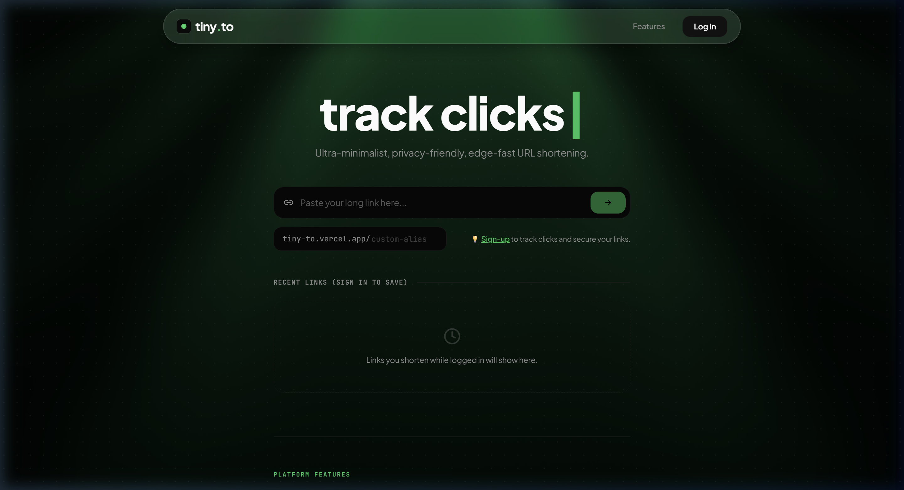

# <p align="center"><br>tiny.to</p>

<p align="center">
  <strong>Ultra-Minimalist, Edge-Fast, and Privacy-Friendly URL Shortening Platform.</strong>
</p>

<p align="center">
  
  
  
  
</p>

---

## 📸 Product Preview

<p align="center">
  
</p>

---

## ✨ Features

- ⚡ **Edge-Fast Redirections**: Powered by Next.js Middleware and Upstash Redis for global sub-millisecond redirect performance.
- 📊 **Detailed Telemetry & Analytics**: Captures visitor country (via Vercel IP headers), OS, browser, referrers, and device categories.
- 🎨 **Immersive Interface**: Sleek dark mode design with a canvas-based responsive `LightRays` background and dynamic GSAP-powered typing interactions.
- 🔗 **Custom Slugs & Brand Control**: Restrict aliases to custom lengths, secure user-specific URL ownership, and prevent link hijacking.
- 🛡️ **Privacy-First Telemetry**: GDPR-compliant analytics that structure visitor patterns without logging raw IP addresses.

---

## 🛠️ Tech Stack

* **Frontend & Serverless**: [Next.js 14 (App Router)](https://nextjs.org/)
* **Database**: [Upstash Redis](https://upstash.com/) (Serverless global KV store)
* **Identity Management**: [Clerk](https://clerk.com/) (Secure Passwordless & OAuth)
* **Styling**: Modern CSS Variables & CSS Modules
* **Visual Effects**: Canvas-based WebGL/OGL interactive shaders, [GSAP](https://gsock.com/) (GreenSock Animation Platform)

---

## 🗄️ Redis Data Architecture

The project leverages high-performance Redis primitives to store and query links:

| Key Format | Type | Description |
| :--- | :--- | :--- |
| `url:${code}` | `string` | Maps a short code/alias to the destination URL. |
| `clicks:${code}` | `string` (Integer) | Tracks total click counts per shortened link. |
| `url_owner:${code}` | `string` | Maps a short code to a Clerk `userId` for permission verification. |
| `user_links:${userId}` | `set` | An index of all short codes generated by a given user. |
| `analytics:${code}` | `list` | A rolling buffer of JSON logs tracking visitor analytics. |
| `user:settings:${userId}` | `string` (JSON) | Custom user parameters (e.g., weekly mail notifications). |

---

## 🚀 Getting Started

### Prerequisites
- **Node.js** (v18.x or newer)
- **npm** (v9.x or newer)
- An active **Upstash Redis** database instance
- A **Clerk** application project

### 1. Installation
Clone the repository and install dependencies:
```bash
git clone <your-repository-url>
cd tiny-to
npm install
```

### 2. Configure Environment
Create a `.env.local` file by copying the template:
```bash
cp .env.example .env.local
```

Populate the following variables inside `.env.local`:
```env
# Upstash Redis
UPSTASH_REDIS_REST_URL=https://your-database.upstash.io
UPSTASH_REDIS_REST_TOKEN=your_token_here

# Domain configuration
NEXT_PUBLIC_SHORT_DOMAIN=localhost:3000

# Clerk Credentials
NEXT_PUBLIC_CLERK_PUBLISHABLE_KEY=pk_test_...
CLERK_SECRET_KEY=sk_test_...
NEXT_PUBLIC_CLERK_SIGN_IN_URL=/login
NEXT_PUBLIC_CLERK_SIGN_UP_URL=/signup
NEXT_PUBLIC_CLERK_AFTER_SIGN_IN_URL=/dashboard
NEXT_PUBLIC_CLERK_AFTER_SIGN_UP_URL=/dashboard
```

### 3. Running Locally
Run the development server:
```bash
npm run dev
```
Open [http://localhost:3000](http://localhost:3000) to view the app in your browser.

---

## 📦 Production Builds & Commands

* **Production Bundle**: Build optimized static pages and server bundles:
  ```bash
  npm run build
  ```
* **Start Server**: Start the server in production mode:
  ```bash
  npm run start
  ```
* **Linting**: Run code style audits:
  ```bash
  npm run lint
  ```
